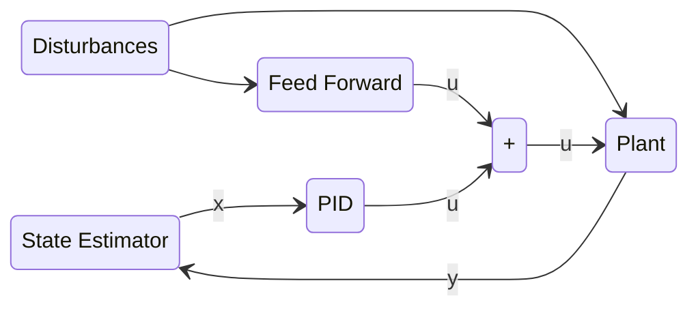

# Cubic

This is the repo where I store the code for Cubic. I'm using this README to document my process and share some of the engineering challanges I went through. So what is Cubic? Inspired by [Cubli](https://www.youtube.com/watch?v=n_6p-1J551Y), it is a cube that can balance on a corner or edge by spinning reaction wheels. Though it balances on the corner, there is always room to make it more robust. Not sure when I will return to this project, but this is certainly not the end. Also for the record, it doesn't jump up, that would be tremendously difficult without machined parts.

<b>Render<b>

VS

<b>Reality<b>

 

## Viability Analysis (July 2021)

Before starting, I recognized that this was not going to be easy. I normally don't consider completion in software projects since the risk is zero, but if I'm buying hardware, I don't want it wasted when I could have done some basic math. So I started with some basic inverted pendulum equations and started playing with the values. How long should the sides be? How much torque does it need? How much inertia do my wheels need? Well I defined thes all as a function of side length. The torque due to gravity is proportional to mass and length or roughly length to the fourth. This incentivises smaller cubes. With this in mind I wanted something around the 100-200mm range so I started looking for some motors. I came to the conclusion that I could realistically pull this off.

### The Motors (August 2021)

I found Nidec24h Motors on ebay. They have fairly high rpm, high torque, built in tachometers, built in drivers. Knowing smaller cubes are better, I ran some numbers on the smallest cube I thought I could make with some rough estimates and found that it should work. Awesome! Let's get designing. 

## Mechanical Design (October 2021)

With my motors picked, I started on the CAD. It was entirely designed with Fusion360 and I started by laying the motors out so they were basically touching. From there, I made the wheels so that they were almost touching (larger wheels is more inertia == higher impulse before the motors reach their peak rpm). I surounded the wheels with a 150mm frame box. From there I made the motor mounts. I found that they all intersected with eachother since the wheels are so large. So I decided to make an inner frame and outer frame. This was a really great desision. Here you can see a basic design I made before picking the motors and one from before I increased the wheel size. 
![[redbox.png]]

![[earlyrender.png]]

### Wait 150mm??

Hold on a second. I plan on 3d printing this since that's the only manufacturing technique I really have. The problem is that my 3d printer has a print volume of 120mm x 120mm x 120mm. So I need to design this thing so that no part is larger than that.

The way I accomplished this is by splitting it into a bunch of parts with dovetails and fasteners. The inner frame is thankfully barely smaller than 120mm so those can be printed in one peice. Then I made these intracet corner pieces that bolt to the inner face, have each edge click on, and have each face click on (with additional bolts). I then made these tpu covers for damping as I knew it would fall a lot. They also cover up the ugly corner joints. Here you can see a render in this stage. A lot of time went into this, the final design in CAD is over 100 revisions. 
![[finaldesign.png]]

You can see the complexity in these corner parts.

![[cornerpeice.png]]

![[tpubumper.png]]

And you can see how everything fits together to make a functional corner here.

![[innercore.png]]

![[cornerassembly.png]]

### Nothing Ever Goes to Plan

I thought about having a small bearing click onto the end of the shaft so the motor and wheels are supported at 2 points, improving rigidity and reducing vibrations. However, there is a problem. I'm not sure if my motors have the pulley attached or if they just have the bare shaft. If they have the pulley, it is not going to work. Well the motors were not here so I started printing. Once the motors arrived, they had the pulleys which were intesection fit on and not coming off. I switched gears and reprinted the face so it would support the pulleys and remade the wheel mount.

This was not ideal but it seemed to work.

### The Wheels (November 2021)

Once I did some more calculations and realized the wheels needed MUCH more inertia, I made them thicker and got them plasma cut at a local shop. These were perfect and make the project look so much more professional.

#### The Wheel Mounts

After discovering that the motors have pulleys, I designed a part to fit onto the pulley. The problem is that the tolerances to create a slip fit quickly wear and become loose. In hindsight, the holes could have been made undersized and inserted with the help of a heat gun. I ended up using white glue and tape to hole them in place. Far from ideal.

### Final Assembly (December 2021)

Now that I finally had all the parts, I could actually assemble them together! This when it started to feel real. It was super validating to see the mechanical design work out.

![[finalassemblynowheels.jpg]]

![[parts.jpg]]

#### Happy Accidents

When I designed it, the corners would be glued together and it would be dissasembled by unbolting everything. What I found is that Each face can stay together and all the faces can click together. This is way better in every way. A neat side effect is that my damping and decorative corner peices now have the structural task of holding all the faces together. This makes servicing it super easy, just pop off 4 corner covers, pop 4 corners appart and removed just one face. The rest stay together. This is a great system and I got really lucky that I designed it in a way that allowed for this.

## Electronics

### The Printed Circuit Board Incident (September 2021)

The first real "failure" of the project (if you must call it that). I wanted to make my own circuit board as I have wanted to learn how to do that for some time. So I picked a chip (esp32) and spent a week reading datasheets, making the schematic and laying out the board. It included everything I needed including the MPU6050 inertial measurement unit that I would use to measure angles. So I ordered the boards and their components. I souldered the board and realized that even though I made extra sure the PCB traces could support the currents, I completely overlooked the power ratings of the components in my power supply circuitry. However, at least I could detect the chip from my computer, which was where I expected the board to fail. Regardless, this was not going to work. 
![[schematic.png]]
![[pcb1.png]]

![[pcb2.png]]

![[pcb.jpg]]

 
I should have realized just by looking at it that the components were too small (look at those tiny components in the top right of the board). Regardless, it was an amazing experience and I learned so much about electronics.

### Plan B

After my custom PCB went up in smoke (No, literally), I pivoted to using an arduino uno I had on hand. I then ordered a battery, step down buck converter, and an MPU6050 (mine was on the board remember?).

Using these I got the motors spinning after a quick panic about how the 12 or 24v motors accept EITHER 12 or 24 not a range so my old 18v laptop power supply would not work. After the mess of wires, I had everything talking to the arduino.

## Software

Wow! I've done so much! I must be at least halfway done right? Right? I just have to write some code. How hard can it be? Well with all the planning I did with the hardware, I did not once consider that maybe I should plan out the software too. Unfortunately this was my biggest mistake and probably one of the biggest lessons I learned, after all it cost me nearly 2 years of struggling when I could have spend a week planning.

Here begins a 2 year long game of guess and check.

### Rust (November 2021)

I love Rust. It's an amazing language. I wont even diss it here because I learned an incredible amount about embedded programming and microcontrollers in the week it took me to get I2C, PWM, and interrupts working (things that are a few lines of code in arduino). The problems came because the atmega328p does not have enough hardware interrupt pins for my 3 tachometers, and IMU (an interrupt was needed for the mpu6050s Digital Motion Processor which I ended up not using). Arduino just pretends it's fine and it somehow works. I have no idea what black magic arduino does to get this to work but I gave up on Rust.

### Start with an Edge (January 2022)

Instead of jumping into balancing on the corner, I made the correct decision to start with the edge and use what I learned for the corner. However, this was no easy task and took months on its own.

 

![[edgebalance.gif]]

### Bottomless Pit of Controls (January 2022 - July 2023)

It was at this point that I started getting close, I experimented with everything I possibly could given the scope. The real problem was my uncertainty caused by the inability to collect data. If I could analyze data it would probably have taken me a tenth of the time. This is the endless game of guess and check I mentioned earlier. I took lots of breaks (including all of first year) and would come back with fresh ideas in my heads to finally get it balancing for real this time. The real demon here is the silicon shortage as I could not get a Pi zero 2. If I could, I could run ROS2 on it and get actual data. However, the best I could do is just run a serial cable directly and hope the cable doesn't affect its behaviour too much. See the path of system architecture to the technical details.

## The Journey of System Architecture

This was a long path of slowly finding the correct algorithms and discovering constraints I had no idea existed. Here are all the major systems and the path I took to arive at them.

### Big Picture System Architecture

### State Estimation

My state estimator definitely introduced too much delay and is what caused me to increase kd to damp the unstable occilations.

### Input Linearization and Feedforward Control

My goal with getting this project working is to eliminate as much nonlinearity as possible. Though this is good in spirit, I never thought that it would come with so much bloat and complexity.

What I did is I knew the wheel inertia, so I ran the motor with the wheel from backwards at full rpm to forwards at full rpm. Since the motors have tachometers, I know the exact speed of the wheel. So I can find the torque of the motor as a function of the current motor velocity and the current 0-1 PWM input. From there I can find the PWM input as a function of desired torque and current velocity.

This would turn out to be very helpful.

### Control Systems

#### LQR

#### Finding The Set Point

kd was far too high, response was overdamped. This is unstable and quickly saturated the reaction wheels. To "solve" this, I made the setpoint move proportional to the wheel rate. It worked, but it was far from robust.

#### Gradient Descent Gain Tuner

### Issues Moving to 3D

When balancing on the corner, there are 2 angles (x,y) and 3 wheels. When it was on the edge, wheel rate was part of the state. This breaks when going for the corner because the 2 states must share the 3 wheels. Each state cannot have its own wheel.

Overall, I learned a ton. I realized I need to start over spend more time planning

## Unstable Success

Though it only balances for a few seconds before accidently throwing itself into an unrecoverable situation, this is a huge success. I came into this project to see my own creation balancing on its corner using hardware I designed and manufacured, running software I wrote. All I can say is mission accomplished. I did what I set out to do and it is soo unbelievably satisfying. I grew as a not only as an engineer but as a person through this project and I am so glad I did it. Will I return to this project with the goal of rock steady stability? Only time will tell. But if I do, you bet I'll do it right with the lessons I've learned so far. Farwell, Cubic. 
![[cornerbalance.gif]]

## What I Would Do Next Time

If I did this project all over, aside from reading the specs of my PCB components, I would plan out the software better.

I didn't even have to consider everything. Just enough to guide me would have made it 100x better. Some basic research on which control algorithm I would use, how I would model it. How I would collect data (and yes you need data). I needed to simulate it in simulink (which for the record, I didn't have access to at the time) to make sure it works. All of this would have made it a much smoother and more robust process.
